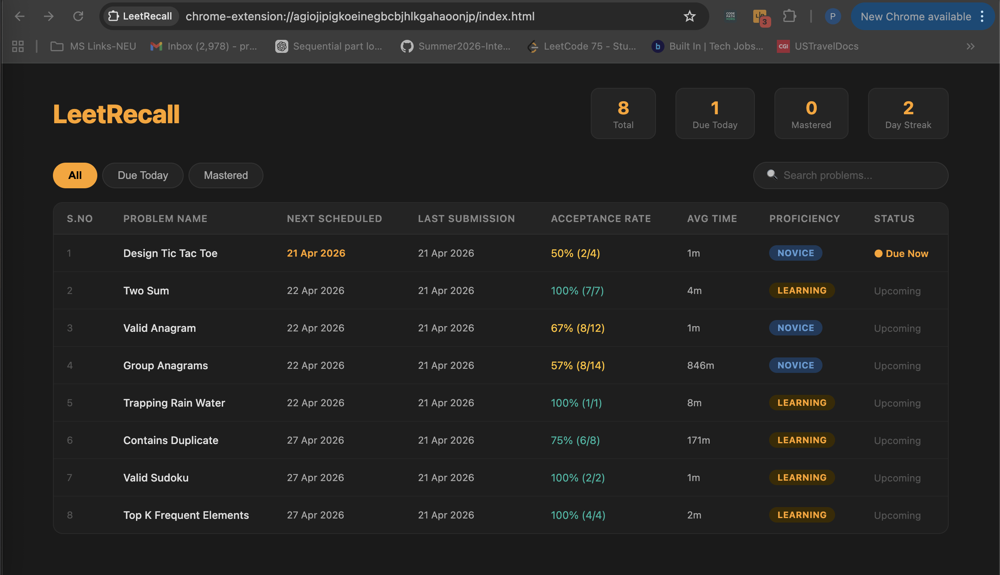
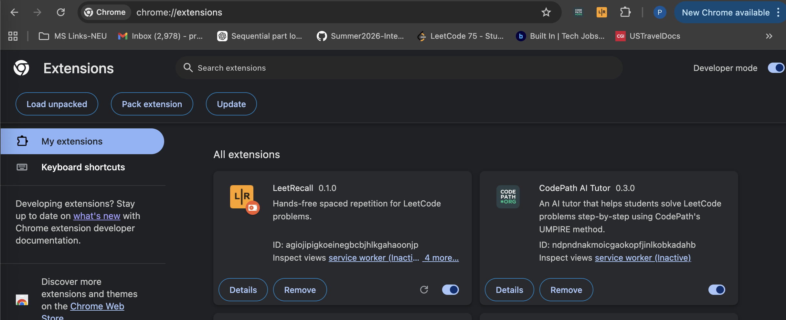
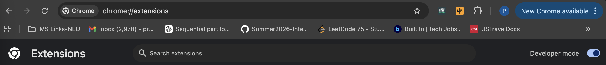
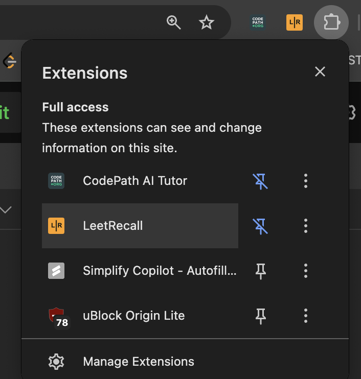
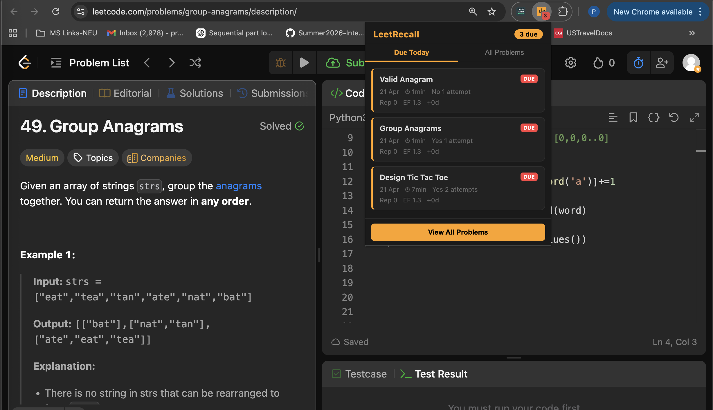
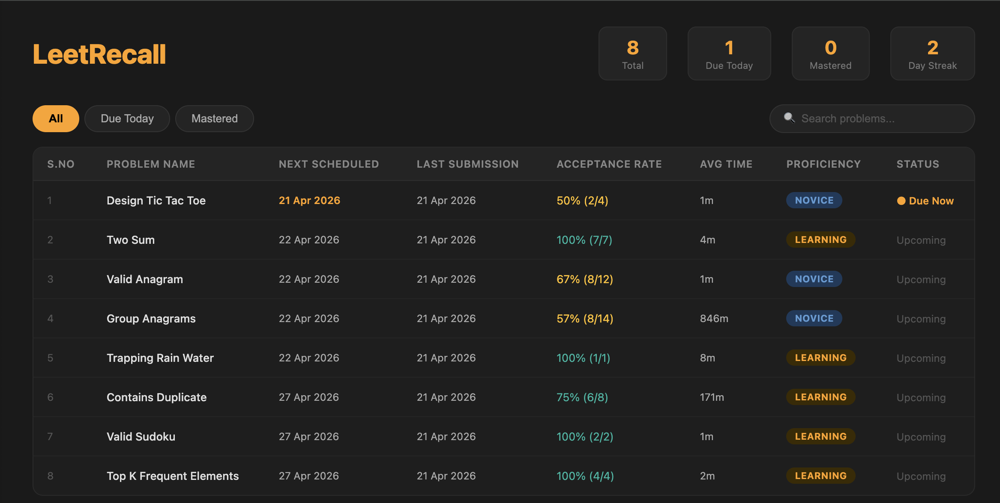
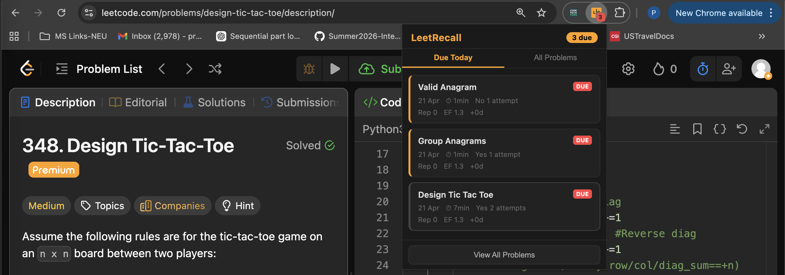
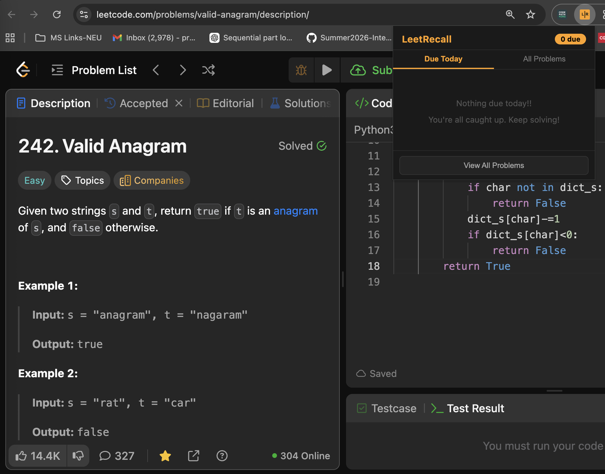
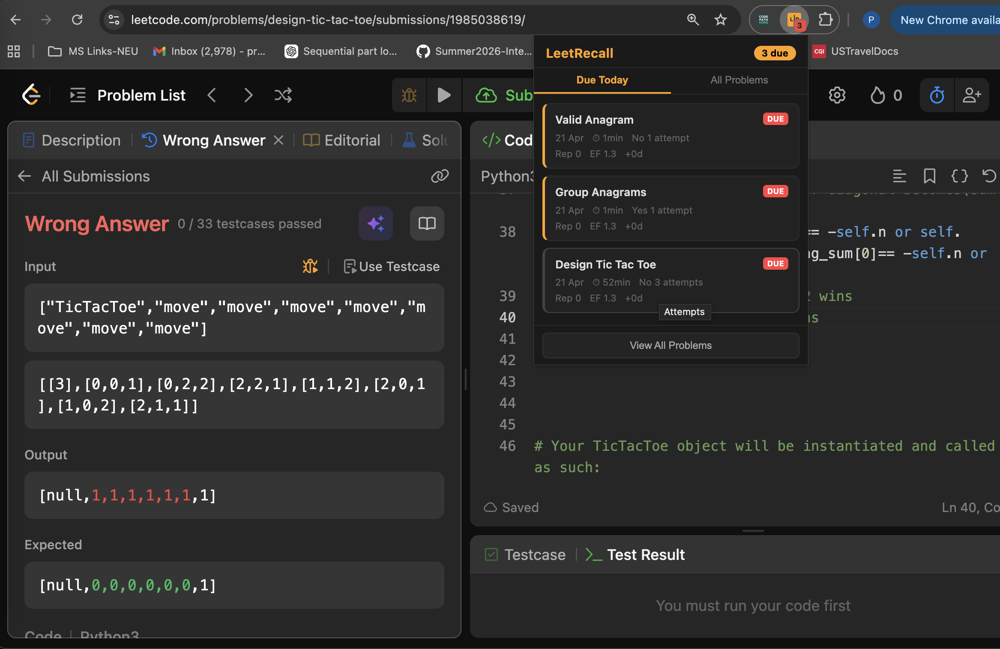
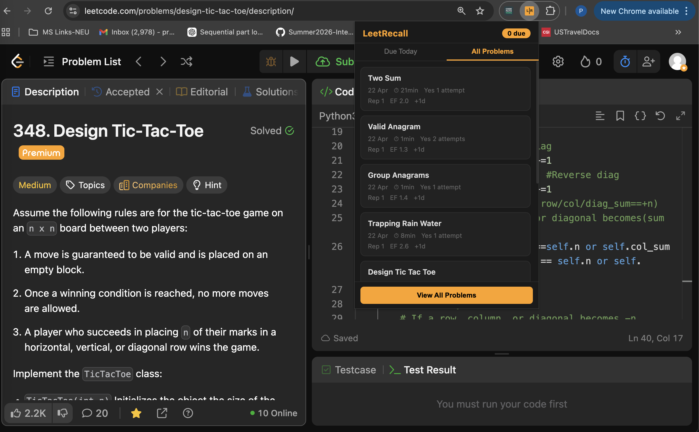

# LeetRecall

> A Chrome extension that turns your LeetCode grind into actual long-term memory.




## The Problem

1) You solve a LeetCode problem today. Feel good about it. Come back two weeks later and you've completely forgotten how to approach it. You re-solve it from scratch. This cycle repeats forever.

2) Most people treat LeetCode like a checklist- solve it once, move on. That's why they blank out in interviews on problems they've "already done."


## The Goal

1) Get mastery over LeetCode questions to prep for technical interviews. Push as many problems as possible to **Mastered** and keep as few as possible at **Novice**.

2) LeetRecall tracks every problem you solve, detects how well you actually know it, and tells you exactly when to review it again, so you stop forgetting what you've already learned.

3) It uses spaced repetition, the same technique behind top memory apps like Anki. Problems you struggle with come back sooner. Problems you know well are spaced out over weeks or months.

## Installation

1. Download this repo — click the green **Code** button above, then **Download ZIP**, and extract the folder anywhere on your computer
2. Open Chrome and go to `chrome://extensions`



3. Turn on **Developer Mode** using the toggle in the top right corner as shown below.



4. Click **Load unpacked** and select the `leetrecall` folder you just extracted
5. The LeetRecall icon will appear in your Chrome toolbar- click the puzzle piece icon in the toolbar and **Pin LeetRecall** so it's always visible at the top



> **Note:** After loading the extension, close and reopen your browser once. LeetRecall registers properly only after a fresh browser start — without this, it may not track your submissions correctly.


## How It Works

**1. Tracks automatically**

LeetRecall listens silently to every submission you make on LeetCode. It captures whether you got Accepted or Wrong Answer, how long you took, how many attempts you needed, and whether you peeked at the Solutions or Editorial tab.



**2. Detects your proficiency per problem**

After each submission it updates your proficiency level for that problem:

Novice → Learning → Familiar → Proficient → Mastered



**3. Recommends smarter reviews**

Your review queue prioritizes problems where proficiency is low. As you improve on a problem, it shows up less and less. The aim is maximum Mastered, minimum Novice.


## What It Looks Like

1) The popup shows your due problems for today. Click any problem to go straight to it on LeetCode.



The full dashboard shows every problem you've tracked — next review date, acceptance rate, average solve time, proficiency badge, and status.


2) When you clear all your due problems for the day, the popup shows a clean slate — nothing pending, you're all caught up.




## Using LeetRecall

**Solving problems**

1) Just use LeetCode normally. Open any problem, write your solution, click Submit. LeetRecall handles everything silently in the background.

2) One important thing: if you click the Solutions or Editorial tab on a problem, LeetRecall treats it as a failed attempt even if you submit correctly after. 
The reasoning is simple: if you needed to look at the answer, you don't really know the problem yet. It schedules it for review today itself so you can try again the same day.

**Where to find your problems after solving**

1) If you got a wrong answer or viewed the solution, it shows up in "Due Today" Tab immediately on same day. You can come back later that evening and it will already be waiting for you.

2) If you solved correctly, it appears in "Due Today" from tomorrow onward for scheduled review.

So the rule is simple: wrong today means due today. Correct today means due tomorrow.



**Checking what's due**

Click the LeetRecall icon in your Chrome toolbar. The Due Today tab shows every problem scheduled for today or overdue. Click any problem title to go directly to it on LeetCode.


**Full dashboard**

Click **View All Problems** in the popup to open the dashboard. From here you can see all your tracked problems, filter by due/mastered, search by name, and see your full stats.



**Daily reminders**

At 9am every day, if you have problems due, you'll get a browser notification. Click it and the dashboard opens directly.

If your laptop was closed at 9am, no worries, the red colored badge counter on the extension icon always shows your due count the moment you open Chrome.


## Proficiency Levels

| Level | What it means |
|---|---|
| Novice | Never successfully reviewed |
| Learning | Early stage, still building familiarity |
| Familiar | Getting comfortable, a few solid reviews |
| Proficient | Consistent good performance |
| Mastered | Strong performance across many reviews — comes back every few months |


## How the Scoring Works

After each submission, LeetRecall gives it a quality score from 0 to 5.

| Score | When |
|---|---|
| 5 | Solved in under 15 min, first attempt |
| 4 | Solved in under 30 min, first attempt |
| 3 | Solved with 1 to 2 attempts |
| 2 | Solved with 3 to 4 attempts |
| 0 | Wrong answer, viewed solution, or gave up |

Higher score means a longer gap before the next review. Score of 0 means it shows up in Due Today immediately on same day.


## Troubleshooting

**Submissions not being tracked**

Go to `chrome://extensions`, find LeetRecall, and click the reload icon. Then close and reopen the LeetCode tab.

**Clearing all data and starting fresh**

Open any LeetCode page, press F12 to open DevTools, go to the Console tab, and run:

```
chrome.storage.local.clear(() => console.log("cleared"))
```


## Tech

Built with plain JavaScript, Chrome Extension Manifest V3, and the SM-2 spaced repetition algorithm. No frameworks, no external dependencies, no servers. Everything runs locally in your browser.